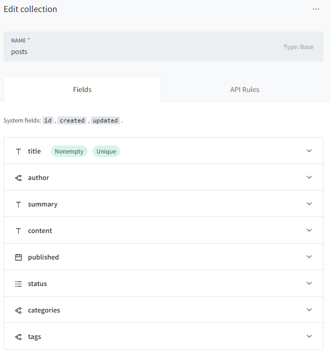

# PocketBaseClient-csharp

**Warning**: This project is in active development, and some parts are only a proof of concept. Things described bellow could change. There is no available release yet.

Client in C# for interacting with a particular PocketBase application, with a simple ORM to manage  Collections and Registries.

## Description

* **PocketBaseClient** includes a set of libraries to interact with PocketBase, and has all the logic needed for the ORM.
* **PocketBaseClient.CodeGenerator** connects with your PocketBase application in order to parse your schema and generates a c# client for your application

### Steps to make your client

- **Download your schema**: use PocketBaseClient.CodeGenerator with *Admin credentials* to connect with your PocketBase application and download your schema definition in a json file
- **Generate the code**: use PocketBaseClient.CodeGenerator again to create the C# code for your client from your downloaded schema definition.
- **Create your client library**: Create an empty C# project (library) for your client:
  - Add a reference to PocketBaseClient
  - Add the generated C# files

### Generated code

PocketBaseClient.CodeGenerator generates all the code needed to map all your **Collections**, **Registries** and **Fields** (including the validation rules):

For each **Collection**:

- Generate a class for the collection (for example _PostsCollection_)
- Generate a class for its Registries (for example _Post_)

**Fields** of **Registries**:

- Each field is a property of the Registry class (for example _Post.Title_)
- If there are restrictions in the PocketBase field, these are translated to Validation Attributes.
- The "**select**" type fields maps to enums
- If the field accept multiple values is mapped to:
  - A specific LimitedList if there are a limit of values
  - A List if there are no limits
- If the field is a "**relation**", is integrated with the ORM to link with the object that represents the related registry
- Fields of type "**file**": Not implemented yet

# Example

Imagine a PocketBase application for a basic blog, with the "*APPLICATION NAME = orm-csharp-test*", and "*APPLICATION URL = https://orm-csharp-test.pockethost.io*"

## PocketBase Collections

For the example, the PocketBase application has the following collections:

- posts: with the blog posts information

- authors: with basic information about authors: name, email, url and profile

- categories: only with name

- tags: only with name

The most "complex" collection is *posts*, with this definition:



Where:

- **title**: Has a "*MIN LENGTH = 5*", is "*Nonempty*" and "*Unique*"

- **author**: Is related to collection "*authors*" with "*MAX SELECT* = 1"

- **summary**: Has a "*MAX LENGTH = 100*" 

- **status**: Select with "*MAX SELECT = 1*", and *CHOICES = draft, to review, reviewed, to publish, published*

- **categories**: relation to "*COLLECTION = categories*" with "*MAX SELECT = 3*"

- **tags**: relation to "*COLLECTION = tags*", without "*MAX SELECT*"

## Generated code

With PocketBaseClient.CodeGenerator, we will generate the code to access to the PocketBase application. 

After generating the code, we can create a new project (library) and include all the generated code, adding a reference to PocketBaseClient, or include all generated code in your main project.

With these steps we will have a custom tools to access our PocketBase application.

The entry point of our application is the class **OrmCsharpTestApplication** (name generated from the Application name "*orm-csharp-test*" )

## Using the code

Whe can use the main application class without any parameter:

```csharp
// Our application with defined url and name inside
var app = new OrmCsharpTestApplication();
```

In the Application main class, we have these main properties:

### Auth

Object with options to authenticate in PocketBase. The authentication may be as "Admin" or "User":

```csharp
// Authenticate as Admin
var resAdmin = await app.Auth.Admin.AuthenticateWithPassword("myadmin@email.io", "MyAdminPwd");

// Authenticate as User
var resUser = await app.Auth.User.AuthenticateWithPassword("myUser@email.io", "MyUserPwd");
```

There are also functions to Reset passwords, authenticate clients with OAuth2, and to create new users.

### Sdk

PocketBaseClient internally uses **[pocketbase-csharp-sdk](https://github.com/PRCV1/pocketbase-csharp-sdk)**

With this property you can access directly to the sdk. In many cases, this access will not be necessary since the generated client will be enough for us.

### Data

This property is the main entry for our data: our collections and registries. With the generated code, we have all collections inside:

```csharp
// Our Collection "posts"
var posts = app.Data.PostsCollection;
// Or
var posts = Post.GetCollection();
```

And we have several ways to access our data:

```csharp
// Accessing a post
var post = app.Data.GetById<Post>("myPostId");
// Or
var post = posts.GetById("myPostId");
// Or
var post = Post.GetById("myPostId");
```

Every post maps a registry in posts Collection, with all fields.

Every field type in PocketBase is converted as a c# equivalent, depending of the restrictions defined in the model:

```csharp
post.Title = "The title";
post.Content = "Lorem Ipsum.... ";
post.Status = Post.StatusEnum.ToPublish;
post.Author = Author.GetById("MyAuthorId");
post.Tags.Add(Tag.GetById("MyTagId"));
```

The defined restrictions in PocketBase are automatically translated as Validations:

```csharp
if (!post.Validate(out var valResult))
{
    foreach (var validationError in valResult)
        Console.WriteLine(validationError);
}
// Or
if (!post.Metadata.IsValid)
{
    foreach (var validationError in post1.Metadata.ValidationErrors)
        Console.WriteLine(validationError);
}
```

You can create new registries as objects, in memory:

```csharp
var post = new Post
{
    Title = "The title",
    Content = "Lorem Ipsum.... ",
    Status = Post.StatusEnum.ToPublish,
    Author = Author.GetById("MyAuthorId")
};
```

And you can modify objects in memory:

```csharp
post.Status = Post.StatusEnum.Reviewed;
```

And Save changes to PocketBase (it does not matter if the record is to be created or updated):

```csharp
post.Save();
// Or
posts.Save(post);
// Or
app.Data.Save(post);
```

Or discard local (in memory) changes:

```csharp
post.DiscardChanges();
// Or
posts.DiscardChanges(post);
// Or
app.Data.DiscardChanges(post);
```

And also, you can delete an element:

```csharp
post.Delete();
// Or
posts.Delete(post);
// Or
app.Data.Delete(post);
```

# 
